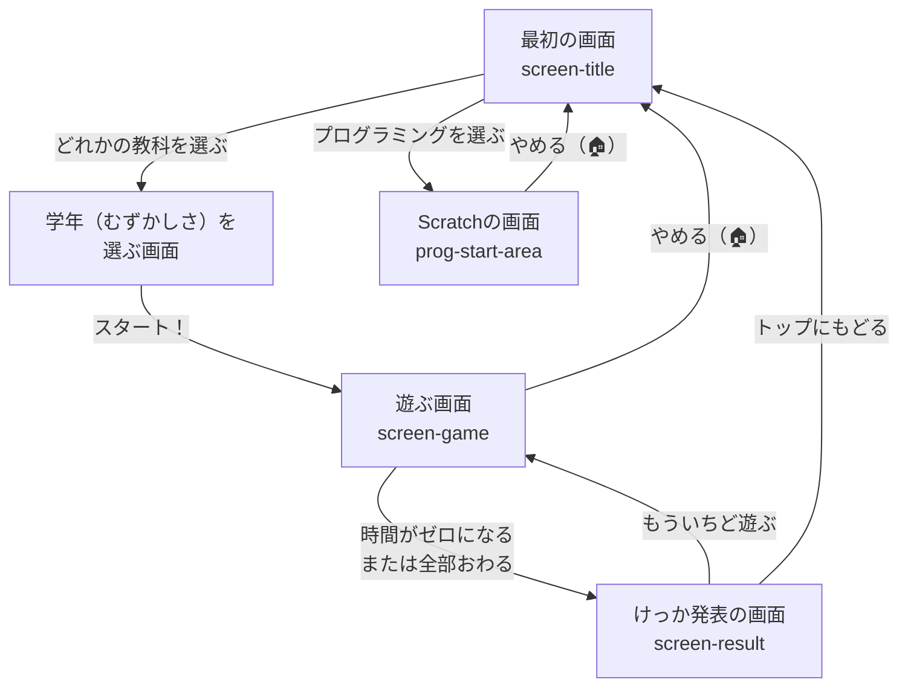

# まなびゲーム 　プログラム設計図（システムマップ）

このファイルは、プログラムが「どのように動いているか」「どのファイルが何をしているか」をまとめた大切な地図（設計図）です。新しく機能を追加するときは、この地図を見てどこを直せばいいか考えよう！

---

## 1. ファイルのお仕事（フォルダの中身）

このゲームは、いくつかのファイルが協力して動いています。

* **`index.html`** （画面の骨組み担当）
  * 画面にどんなボタンや文字を置くかを決めるファイルです。
* **`style.css`** （デザイン・お化粧担当）
  * アニメーション、色、大きさ、配置など、見た目をカッコよくするファイルです。
* **`game.js`** （脳みそ・動きのコントローラー担当）
  * 「Aのボタンが押されたら、問題を変える」「正解したらスコアを増やす」といったゲームのルールや動きがすべて書かれています。
* **`kanji_data.js` / `typing_data.js`** （問題を作るデータ担当）
  * 出題される漢字のクイズや、タイピングのお題（答え）がたくさん保存されている倉庫のようなファイルです。
* **`bgm.js` / `bgm.mp3`** （音楽担当）
  * BGMを流したり、正解したときのポロロン♪という効果音（SFX）を鳴らす仕組みが書かれています。
* **`sw.js` / `manifest.json`** （どこでも遊べる魔法担当）
  * PWA（ピー・ダブリュー・エー）という機能を使って、インターネットがない場所（オフライン）でもスマホなどで遊べるようにしています。

---

## 2. 画面の進み方（フローチャート）

ゲームの画面は、以下のような順番で切り替わります。
（※ `game.js` の中にある `showScreen()` という命令で切り替えています）



---

## 3. 問題のデータはどうなっているの？

タイピングや漢字クイズのデータは、プログラムの中で「リスト（配列）」と「辞書（オブジェクト）」という形できれいに整理されています。

**【タイピングのデータの例】**
```javascript
// 小学校1年生のデータ（TYPING_DBの「grade1」）
[
  { display: "いぬ", romaji: "inu" },
  { display: "ねこ", romaji: "neko" }
]
```
* `display` は画面に出る「ひらがな（カタカナ）」。
* `romaji` が、正解になるキーボードの打ち方です。

問題を増やしたいときは、このカッコ `{ }` のカタマリをどんどん下に追加していくだけで自動的にゲームに登場します！

---

## 4. プログラムをさわるときの「合言葉」

自分が書いたプログラムを変えたのに「画面が変わらない！」というときは、古いプログラムがブラウザに残っている（キャッシュといいます）のが原因のことが多いです。

**【合言葉：更新（こうしん）ボタンを数回押す！】**
プログラムを直したら、`sw.js`（魔法のファイル）のバージョン（v1, v2 など）の数字を一つ上げてから、ブラウザの更新（丸い矢印のボタン）を2〜3回押しましょう。そうすると最新のプログラムが読み込まれます！
